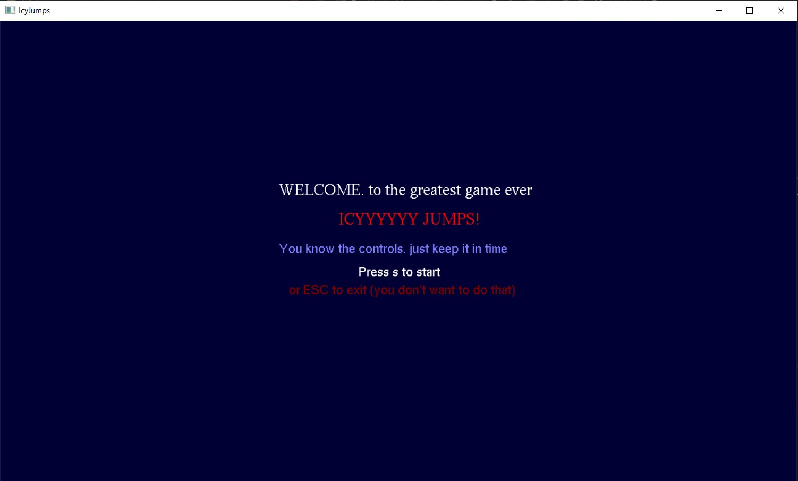

# ICYJUMPS

Icyjumps is a game based on the idea of icytower but instead of moving the scene up the character is spawned at the bottom of the window and tries to go to the flag at the top of the window by jumping on horizontal objects before the time hits zero. We developed the game using C++ programming language and OpenGL API. The game window is of size 1200:700 pixels with position (100,50) concerning player screen dimensions.

Let's run!

# watch the demo gameplay on YouTube
https://youtu.be/r6aflqiyKYY?si=vH1XScyFnTxnTOBW

## Description 

On the start page. There is a welcome message with instructions

***

The in-game scene consists of a column on the left and the right border of the window with Palestine flag drawn on the right column, the objects drawn as lines that help the character to reach the flag, the timer, hurry up warning, and of course the character which is spawned on the center bottom of the scene, the flag which is the destination of the character to reach it to win before the time runs out.

***

If you didn't make it on time, the game over scene will be displayed.

***

If you win the greeting scene will be displayed.

## Controls

The controls are easy just up arrow for the jump, left/right for moving left/right, and don't worry about going down, the gravity will do its work (you don't want to go down as you don't have too much time).

## Contributors
Mostafa Nabil mostafan22034405@gmail.com

Omar Gamal Oelmasry275@gmail.com

and me alihisham26m@gmail.com

***

Thank you for reading.
